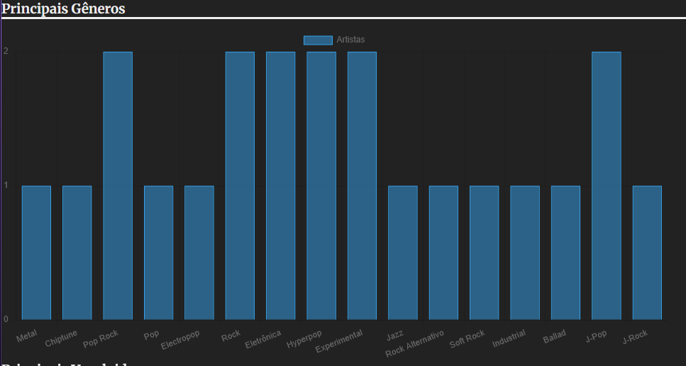
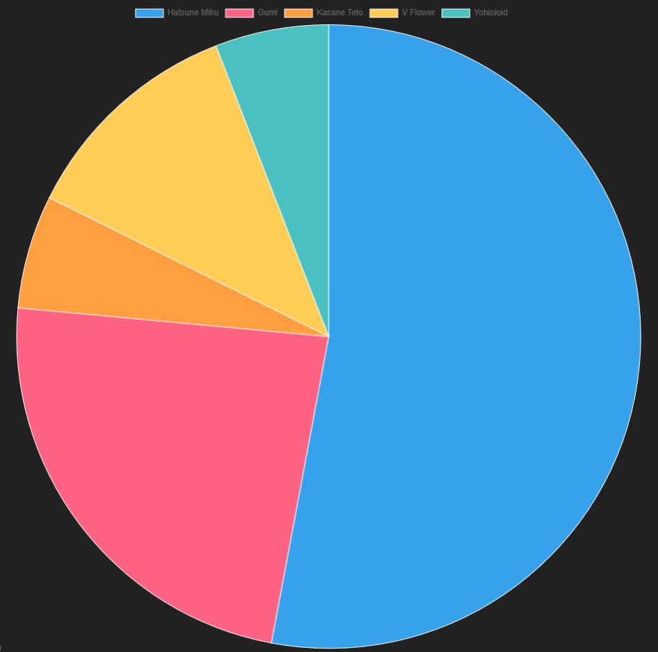

# Trabalho Prático 07 - Semanas 13 e 14

A partir dos dados cadastrados na etapa anterior, vamos trabalhar formas de apresentação que representem de forma clara e interativa as informações do seu projeto. Você poderá usar gráficos (barra, linha, pizza), mapas, calendários ou outras formas de visualização. Seu desafio é entregar uma página Web que organize, processe e exiba os dados de forma compreensível e esteticamente agradável.

Com base nos tipos de projetos escohidos, você deve propor **visualizações que estimulem a interpretação, agrupamento e exibição criativa dos dados**, trabalhando tanto a lógica quanto o design da aplicação.

Sugerimos o uso das seguintes ferramentas acessíveis: [FullCalendar](https://fullcalendar.io/), [Chart.js](https://www.chartjs.org/), [Mapbox](https://docs.mapbox.com/api/), para citar algumas.

## Informações do trabalho

- Nome: Gabriel Katahira Cordeiro
- Matricula: 899301
- Proposta de projeto escolhida:1. Pessoas e Produções
- Breve descrição sobre seu projeto: Um site que coleta e categoriza diversos artistas Vocaloid, de acordo com gênero, idioma e principais Vocaloids. Vocaloid é um software que é usado, principalmente por artistas japoneses, para poder sintetizar vozes para integrar em suas músicas. O software conta com diversos Vocaloids diferentes, que representam vozes diferentes.

**Print da tela com a implementação**

Uso do Chart.js para registrar os principais Gêneros e Vocaloids utilizados por todos os artistas

